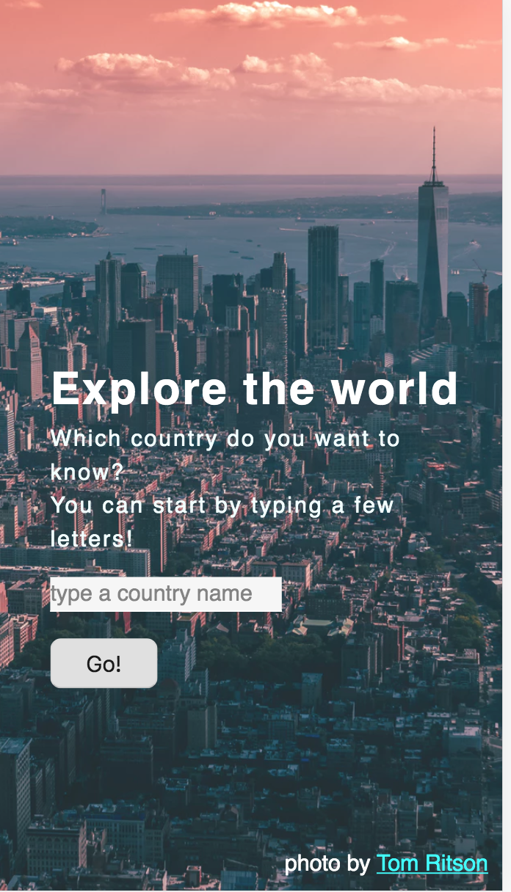
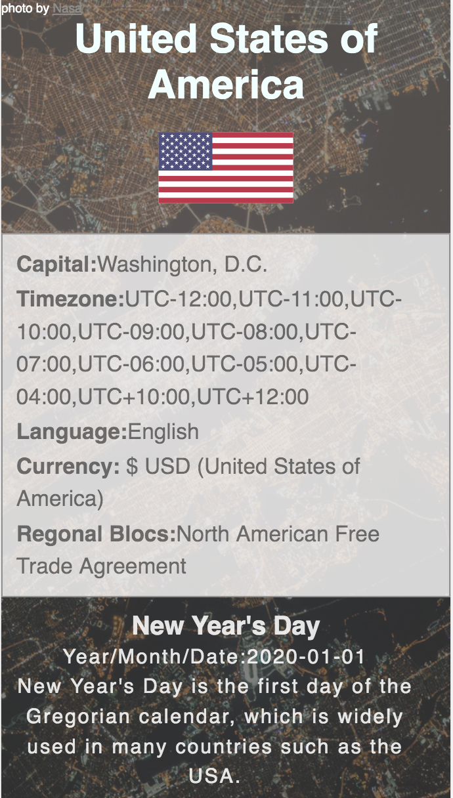

# exploreworld
##My API hack project##
<a href= "https://emilystacy.github.io/exploreworld/"> Link to my Live App </a>

 This App allows the users to
<ul> 
  <li> type in a country name or random strings and return a country or region
  <li> find out the capital, timezone, language, currency and regional blocs of the country or region
  <li> find out the national holidays in the country or region 
  <li> find out some YouTube videos about traveling in this country or region(limited quota each day)
  </ul>
  
 This App includes
  <ul>
    <li> HTML 5 </li> 
    <li> CSS </li>
    <li> JavaScript </li>
    <li> jQuery </li>
    <li> The use of three APIs  </li>
    </ul>
